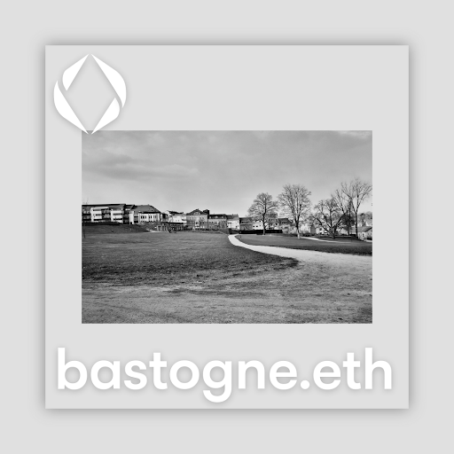
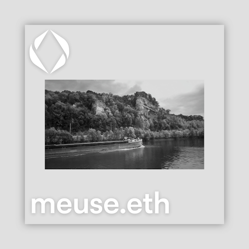
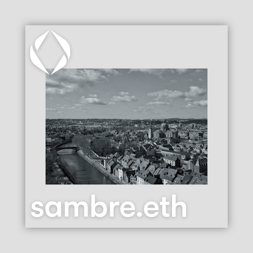
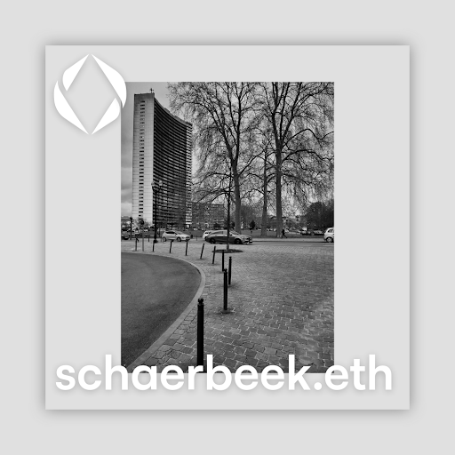

---
layout:
  title:
    visible: true
  description:
    visible: true
  tableOfContents:
    visible: false
  outline:
    visible: false
  pagination:
    visible: true
---

# APPENDIX

### Geolocation and `Number` of Photographs

[Antwerp](https://foundation.app/collection/awalkaday-art?attr=attributes.LOCATION%3AAntwerp%2C+Belgium)  `21`

[Bastogne](https://foundation.app/collection/awalkaday-art?attr=attributes.LOCATION%3ABastogne%2C+Belgium)  `48`

[Brussels](https://foundation.app/collection/awalkaday-art?attr=attributes.LOCATION%3ABrussels%2C+Belgium)  `42`

[Gembloux](https://foundation.app/collection/awalkaday-art?attr=attributes.LOCATION%3AGembloux%2C+Belgium)  `1`

[Huy](https://foundation.app/collection/awalkaday-art?attr=attributes.LOCATION%3AHuy%2C+Belgium)  `2`

[Libramont](https://foundation.app/collection/awalkaday-art?attr=attributes.LOCATION%3ALibramont%2C+Belgium)  `8`

[Liège](https://foundation.app/collection/awalkaday-art?attr=attributes.LOCATION%3ALi%C3%A8ge%2C+Belgium)  `10`

[Marche-en-Famenne](https://foundation.app/collection/awalkaday-art?attr=attributes.LOCATION%3AMarche-en-Famenne%2C+Belgium)  `2`

[Marloie](https://foundation.app/collection/awalkaday-art?attr=attributes.LOCATION%3AMarloie%2C+Belgium)  `1`

[Metz, France](https://foundation.app/collection/awalkaday-art?attr=attributes.LOCATION%3AMetz%2C+France)  `2`

[Namur](https://foundation.app/collection/awalkaday-art?attr=attributes.LOCATION%3ANamur%2C+Belgium)  `116`

[Nivelles](https://foundation.app/collection/awalkaday-art?attr=attributes.LOCATION%3ANivelles%2C+Belgium)  `1`

[Waremme](https://foundation.app/collection/awalkaday-art?attr=attributes.LOCATION%3AWaremme%2C+Belgium)  `9`

### Fun Facts

The photograph on the [cover of this book](./), _awalkaday 251-2022_, was taken and published prior to the installation of a sculpture on the same site inside a public park in Namur (Wallonia, Belgium). &#x20;

<figure><figcaption>
<em>awalkaday 251-2022</em>
</figcaption></figure>

The black-and-white photo captured a fleeting moment in time before the old sculpture was moved to its current and permanent location. It immortalized a romantic outdoor scene : a lovely couple sitting on the grass in the shade of a glowing tree.&#x20;


Check out the onchain photo on The Hug.


Sculpted in bronze by Belgian artist [_Nat Neujean_](https://www.natneujean.com/), _The Daughters of Water_ (1951) depicts two intertwined nymphs, symbolizing two European rivers : the [_Meuse_](https://en.wikipedia.org/wiki/Meuse) and the [_Sambre_](https://en.wikipedia.org/wiki/Sambre). These recent photos of the famous sculpture were taken on May 8th, 2024. Coincidentally, this date marks the end of Second World War in Europe and the victory of democracy over fascism.

_awalkaday 251-2022_ and _The Daughters of Water_ both have their roots in a 19th century park. The park is named after the first Queen of the Belgians, _Louise-Marie_. Notice the uncanny resemblance between the setting of the bronze nymph sculpture (below) and the photo of a romantic couple (above).

<figure><figcaption></figcaption></figure>

 

<figure><figcaption></figcaption></figure>

 

<figure><figcaption></figcaption></figure>

 

<figure><figcaption></figcaption></figure>

### Photo Showcase + Ethereum domain names

Four [ENS domains](https://ens.domains/), named after Belgian towns and rivers, are adorned with [awalkaday.art](https://app.zerion.io/0xb5ee030c71e76c3e03b2a8d425dbb9b395037c82/nfts?collections=116) photographs. The local landscape was mapped and displayed on an Ethereum blockchain naming protocol to celebrate a week of blockchain-focused international conferences in Belgium: [EthCC \[7\]](https://ethcc.io/archive?page=1\&event=EthCC%5B7%5D) & [ETHGlobal Brussels 2024](https://ethglobal.com/events/brussels).&#x20;

<figure><figcaption>
<a href="https://app.zerion.io/nfts/ethereum/0x57f1887a8bf19b14fc0df6fd9b2acc9af147ea85:47981481869610083995936073997732283750222809913612277762499411613608388596160">bastogne.eth</a>
</figcaption></figure>

 

<figure><figcaption>
<a href="https://app.zerion.io/nfts/ethereum/0x57f1887a8bf19b14fc0df6fd9b2acc9af147ea85:97365202193083432748976546813491271006919194810609036242907411146017330782368?address=0xb5ee030c71e76c3e03b2a8d425dbb9b395037c82">meuse.eth</a>
</figcaption></figure>

<figure><figcaption>
<a href="https://app.zerion.io/nfts/ethereum/0x57f1887a8bf19b14fc0df6fd9b2acc9af147ea85:98656978081170204584090953328403136752112004695015963955947111110569277154361">sambre.eth</a>
</figcaption></figure>

 

<figure><figcaption>
<a href="https://app.zerion.io/nfts/ethereum/0xd4416b13d2b3a9abae7acd5d6c2bbdbe25686401:22609889999588536487736404583550363407381519385506395789547348851782388298946?address=0xb5ee030c71e76c3e03b2a8d425dbb9b395037c82">schaerbeek.eth</a>
</figcaption></figure>

