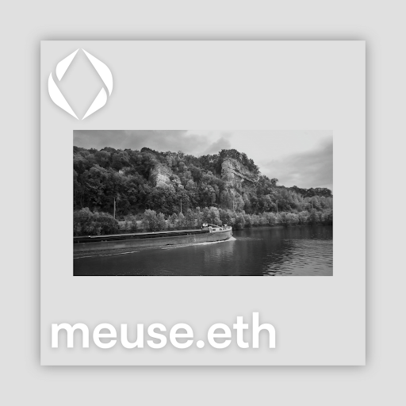
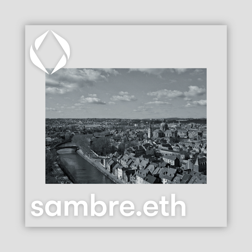
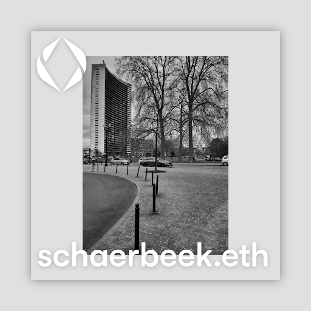

# APPENDIX

### Visual Fun Facts

The photograph on the [cover](./), `awalkaday 251-2022`, was shot, edited and published online prior to the installation of a sculpture on the same site inside a public park in Namur (Wallonia, Belgium).

<figure><figcaption>
awalkaday 251-2022
</figcaption></figure>

This black-and-white photo captured a fleeting moment in time before a renowned sculpture was moved to its current and permanent location. It preserves for ages a romantic outdoor scene: a couple of people sitting in the open air on the grass under a glowing tree.


Check out the onchain photo on The Hug.


Sculpted in bronze by Belgian artist [Nat Neujean](https://www.natneujean.com/), _The Daughters of Water (1951)_ depicts two intertwined nymphs, symbolizing two European rivers: [Meuse](https://en.wikipedia.org/wiki/Meuse) and [Sambre](https://en.wikipedia.org/wiki/Sambre). The colorful photographs of the sculpture were taken on the 8th day of May in 2024, a day that commemorates the second war-ending victory of democracy over fascist ideologies across Europe in the mid-20th century.

<figure><figcaption></figcaption></figure> <figure><figcaption></figcaption></figure> <figure><figcaption></figcaption></figure>

`awalkaday 251-2022` and [_The Daughters of Water_](https://statues.vanderkrogt.net/object.php?webpage=ST\&record=bena030) both have their roots in a 19th century park named after the first Queen of the Belgians, _Louise-Marie_. Notice the timeless traits of two art forms grounding a duo — one in human form and another in metallic form — in the shade of a slowly aging tree.

### Ethereum Domain Names

Four [ENS domains](https://ens.domains/), owned by [`daqhris.eth`](https://app.ens.domains/daqhris.eth) and named after Belgian towns and rivers, have been decorated with [`awalkaday`](https://app.zerion.io/0xb5ee030c71e76c3e03b2a8d425dbb9b395037c82/nfts?collections=85657215) photographs. The local landscape was mapped and displayed on an Ethereum blockchain naming protocol to celebrate a rare week of international conferences in Belgium: [EthCC \[7\]](https://ethcc.io/archive?page=1\&event=EthCC%5B7%5D) & [ETHGlobal Brussels](https://ethglobal.com/events/brussels) in the summer of 2024.

<figure><figcaption>
<a href="https://app.zerion.io/nfts/ethereum/0x57f1887a8bf19b14fc0df6fd9b2acc9af147ea85:97365202193083432748976546813491271006919194810609036242907411146017330782368?address=0xb5ee030c71e76c3e03b2a8d425dbb9b395037c82"><strong>meuse</strong>.eth</a>
</figcaption></figure> <figure><figcaption>
<a href="https://app.zerion.io/nfts/ethereum/0x57f1887a8bf19b14fc0df6fd9b2acc9af147ea85:98656978081170204584090953328403136752112004695015963955947111110569277154361"><strong>sambre</strong>.eth</a>
</figcaption></figure>

<figure><figcaption>
<a href="https://app.zerion.io/nfts/ethereum/0x57f1887a8bf19b14fc0df6fd9b2acc9af147ea85:47981481869610083995936073997732283750222809913612277762499411613608388596160"><strong>bastogne</strong>.eth</a>
</figcaption></figure> <figure><figcaption>
<a href="https://app.zerion.io/nfts/ethereum/0xd4416b13d2b3a9abae7acd5d6c2bbdbe25686401:22609889999588536487736404583550363407381519385506395789547348851782388298946?address=0xb5ee030c71e76c3e03b2a8d425dbb9b395037c82"><strong>schaerbeek</strong>.eth</a>
</figcaption></figure>

**`BACK-1`**
