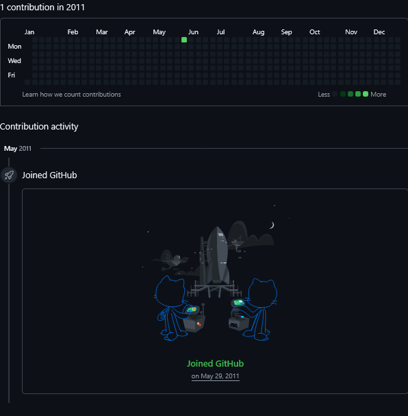

# GIT Usage History

<figure><figcaption>
awalkaday 212-2021
</figcaption></figure>

The oldest GIT commits pushed up and signed by `daqhris` date back to [February 2016](https://github.com/daqhris/hello-world/commits/master/?since=2016-02-22\&until=2016-06-15). They may be seen as the remnants of an extracurricular passion that infused an innovative spirit into a student's life in the East, spent crossing over the [Great Firewall of China](https://www.theguardian.com/news/2018/jun/29/the-great-firewall-of-china-xi-jinpings-internet-shutdown), and bypassing man-made virtual walls through private tunnels to wave [_hello_ to the _world_](https://github.com/daqhris/hello-world/commits/master/?since=2016-02-22\&until=2016-06-15).

<figure><figcaption>
awalkaday 211-2021
</figcaption></figure>

Much earlier fragments of his public coding blocks were likely archived inside the GitHub-sponsored [Arctic Code Vault](https://arcticworldarchive.org/collection/arctic-code-vault/) in [February 2020](https://archiveprogram.github.com/arctic-vault/), among notable human-crafted software artifacts, for over a thousand years.


awalkaday 356-2017


Looking way back, an initial foray into a central hub of GIT repositories in May 2011, at the [age of nineteen](https://github.com/daqhris?tab=overview\&from=2011-05-01\&to=2011-06-01) in Bujumbura, Burundi (Africa), seems comparable to planting a seed of innovation in the fertile soil of a burgeoning digital platform.&#x20;

<figure><figcaption>
Screenshot of his first activity, as a Git user and contributor, time-stamped to <a href="https://github.com/daqhris?from=2011-05-01&#x26;tab=overview&#x26;to=2011-06-01">2011</a>
</figcaption></figure>

That seed has since blossomed into a time-stamped nomadic odyssey — rooted in cyberspace, erected tall by a slender figure, and grounded on Belgian soil — `awalkaday.art`_._

<figure><figcaption>
awalkaday 66-2022
</figcaption></figure>

<strong><code>19</code></strong>

