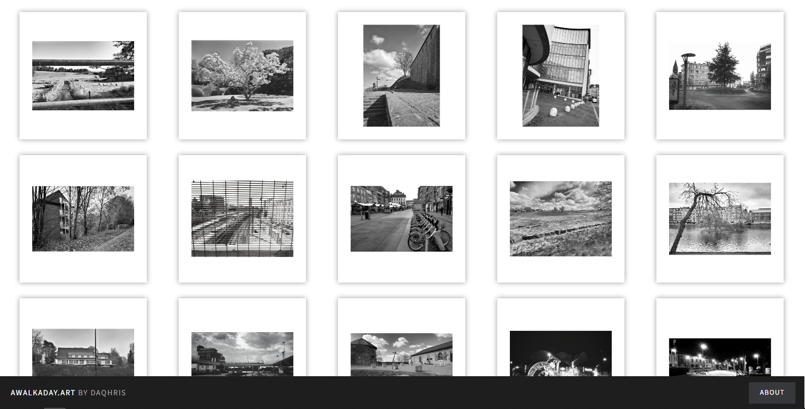

# Web Gallery

<figure><figcaption>
<strong>awalkaday 42-2022</strong>
</figcaption></figure>

Once the art project was resumed in the [spring of 2021](https://github.com/awalkaday/about-awalkaday-art/commit/32eced8e914f46d9364a5d5fb6ec11c5bd7be7a4), a limited number of the salvaged photos began to be steadily uploaded to a purpose-built web gallery, [`awalkaday.art`](https://awalkaday.art/), which ultimately hosts a catalog of 263 photographs from the collection in a custom-designed, interactive and responsive gallery.

  <a href="https://awalkaday.art" rel="noopener" target="_blank">awalkaday.art</a>

<figure><figcaption>
A screenshot of the custom-built web gallery
</figcaption></figure>

The web gallery prioritizes a smooth and random order of display for each visit, allowing for ease of navigation and discovery of photographs by surprising visitors with fresh-eye perspectives every load time. The gallery's code enforcing mathematical randomness in JavaScript dates from [February 2023](https://github.com/awalkaday/awalkaday-art/commits/master/assets/js/main.js).

  <a href="https://github.com/awalkaday/awalkaday-art/commit/3043b3f1e58f05bfdefd7bdf9afcf9fddcf9ea96" rel="noopener" target="_blank">github.com</a>

  <a href="https://www.instagram.com/walk.day/reel/C4lci5_r0a8/" rel="noopener" target="_blank">www.instagram.com</a>

<strong><code>14</code></strong>

