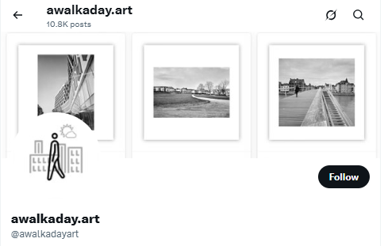

# X (Twitter)

[X](https://x.com/) allows its users to share short-form media works and fosters real-time engagement in public conversations. Over time, it became a habit to float over the digital sea of information, and to flock around inspiring figures twittering about a myriad of topics.

<figure><figcaption></figcaption></figure>

News and viewpoints related to the photo collection have been broadcast on X, where the artist posting via [@awalkadayart](https://twitter.com/awalkadayart) connects with a diverse audience, announces key milestones, and builds relationships with artists, researchers, supporters and collectors.


awalkaday 220-2022


<strong><code>15</code></strong>

