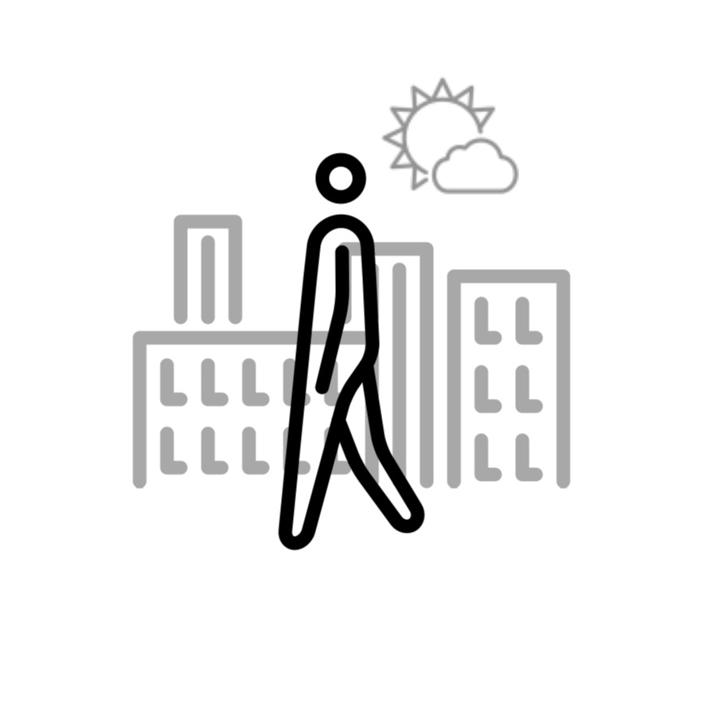
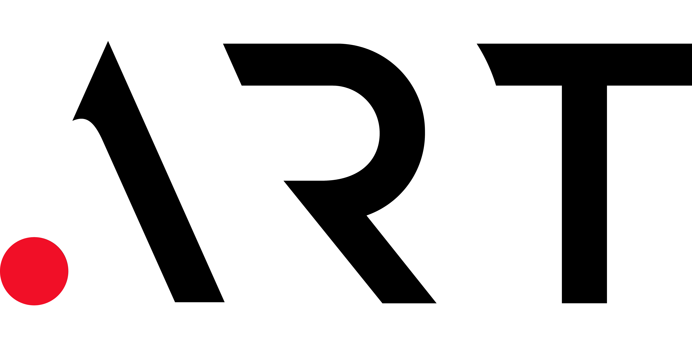
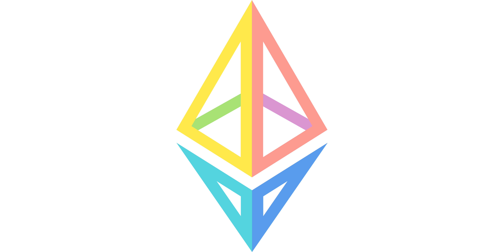

---
layout:
  title:
    visible: true
  description:
    visible: false
  tableOfContents:
    visible: false
  outline:
    visible: false
  pagination:
    visible: true
---

# IMPRINT

### Public Licensing

`awalkaday.art` • Handbuilt with 🤍 • Made in 🇧🇪\
_An Undocumented Artistic Product of Afro-Surrealism_

Photos & Texts: [CC Attribution-NonCommercial-NoDerivatives 4.0](https://creativecommons.org/licenses/by-nc-nd/4.0/deed.en)\
Source Code: [European Union Public Licence v. 1.2](https://joinup.ec.europa.eu/sites/default/files/custom-page/attachment/2020-03/EUPL-1.2%20EN.txt)

<figure><figcaption></figcaption></figure>

***

### Copyrights

Author & Publisher: © 2024 [Chris-Armel Iradukunda `daqhris`](https://daqhris.com)

<table data-card-size="large" data-column-title-hidden data-view="cards" data-full-width="false"><thead><tr><th></th><th></th><th></th><th data-hidden data-card-target data-type="content-ref"></th></tr></thead><tbody><tr><td></td><td><a data-mention href="./">.</a></td><td></td><td><a href="imprint.md">imprint.md</a></td></tr></tbody></table>

_Initial online publication: July 2024_ • _Recent changes:_ [_Oct 2024_](https://github.com/awalkaday/about-awalkaday-art/commits/book/)\
_Open-sourced by `daqhris`(assisted by `gitbook-bot`)_


[Aug 25, 2024](https://x.com/awalkadayart/status/1827817564790981047): Promo video of the artist's book (as posted on X)



There is no print, e-book or tokenized version available yet. No part of this online book may be reproduced or transmitted in any form or by any means, electronic or mechanical, including photocopying, recording, or any other information storage and retrieval system, for commercial purposes, without the prior permission and consent in writing of the publisher.

If you remix, transform or build upon the material, you may not distribute the modified material. You must give appropriate credit to the author, provide copies of the CC BY-NC-ND 4.0 and EUPL-1.2 licenses, and indicate whether any modifications have been made. You are free to share, copy, download and redistribute the material in its original medium or format.

Its legal rights shall be governed by [Belgian law](https://www.wipo.int/wipolex/en/text/125254), as the licensor has no affiliation with another Member State of the European Union. The 'right of the soil' _(_in latin, _jus soli)_ applies to this book, without prejudice to the ethical virtues of [#public-licensing](imprint.md#public-licensing "mention"). The moral right of the author has been asserted.


***

### Online Photo Store




awalkaday 91-2022


***

### Acknowledgments

#### Caregiving Friends

A token of gratitude goes to Adva Z., Alice & Cyril, Andrée D., Anna R., Ant H., Britt H., Christine C., Christophe M., Effi & Amir, Peter K., Shila A., Suleiman Z., Valérie H. and Willeke V.

#### Book Publication

<figure><figcaption>
<a href="https://www.g2.com/products/gitbook/reviews/gitbook-review-9962377">Business Plan for Open-Source</a>
</figcaption></figure>

#### Internet Registry

<figure><figcaption>
<a href="https://x.com/Art_Domains/status/1755917791658418315">Praised online by .ART domains</a>
</figcaption></figure>

#### Blockchain Network

<figure><figcaption>
<a href="https://zora.co/collect/eth:0xe31801c2e58b151c3ded2cb29da56147b7f27eb1">Photo series minted on Ethereum</a>
</figcaption></figure>

#### Brussels Public Library

<figure><figcaption>
<a href="https://x.com/search?q=from%3A%40awalkadayart+muntpunt&#x26;t=c0hdmw8z3Sk8WBtAwMj-DQ">Inspired by photo books from Muntpunt</a>
</figcaption></figure>

<figure><figcaption>
<em>awalkaday 105-2022</em> portrays <a href="https://muntpunt.be/over-muntpunt">Muntpunt</a>
</figcaption></figure>

#### Storytelling Training

<figure><figcaption>
Observer: <a href="https://soundimageculture.org/laboratory/#sic-regular-text-block_cd5d0fa1e38b295170f402ac3a73b7d6">SIC Collective Sessions</a> ('23-'24)
</figcaption></figure>

#### `BACK-1`
