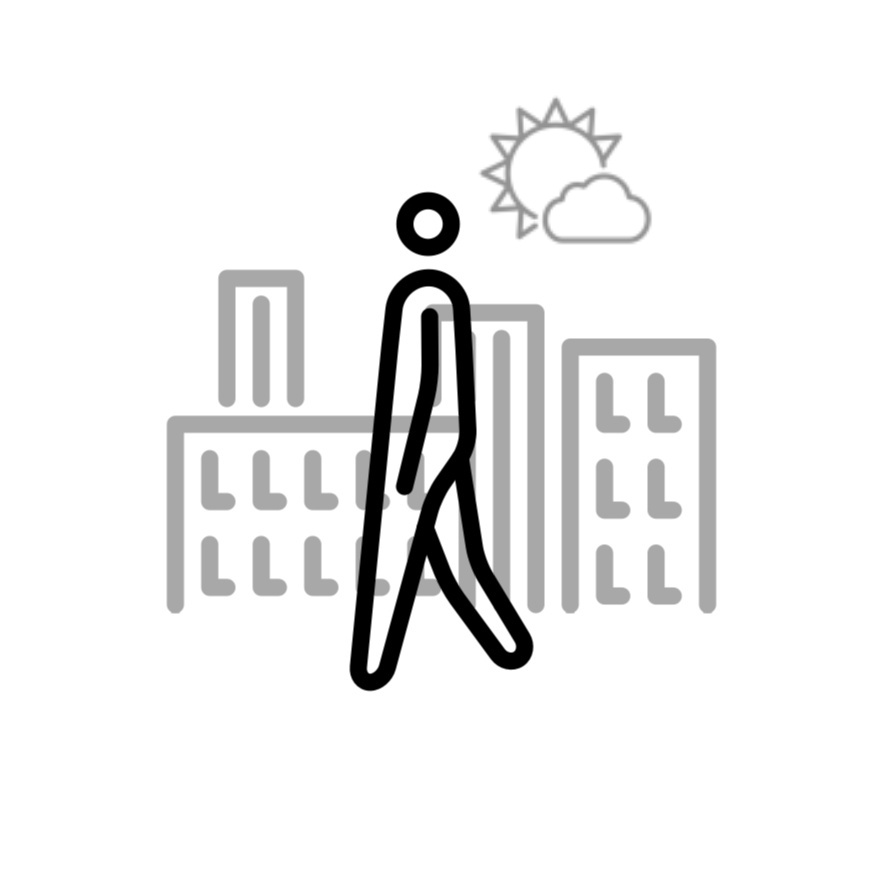
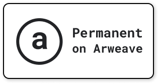

---
layout:
  title:
    visible: true
  description:
    visible: false
  tableOfContents:
    visible: false
  outline:
    visible: false
  pagination:
    visible: true
---

# IMPRINT

### Public Licensing

`book.awalkaday.art` • Written with 🤍 • Made in 🇧🇪\
&#xNAN;_&#x41;n Undocumented Artistic Product of Afro-Surrealism_\
&#xNAN;_&#x42;y an Undocumented Artist on the Land of Surrealism_

Photos & Texts: [CC Attribution-NonCommercial-NoDerivatives 4.0](https://creativecommons.org/licenses/by-nc-nd/4.0/deed.en)\
Source Code: [European Union Public Licence v. 1.2](https://joinup.ec.europa.eu/sites/default/files/custom-page/attachment/2020-03/EUPL-1.2%20EN.txt)\
[ISBN](https://en.wikipedia.org/wiki/ISBN): No Unique-Book-ID yet

<figure><figcaption></figcaption></figure>

### Copyrights

Author & Publisher: © [Chris-Armel Iradukunda](https://daqhris.com/) ([daqhris](https://github.com/daqhris))

_Initial online publication:_ [_July 2024_](https://github.com/awalkaday/about-awalkaday-art/compare/about...book)\
&#xNAN;_&#x52;ecent content changes:_ [_June 2025_](https://github.com/awalkaday/about-awalkaday-art/commits/book/)\
&#xNAN;_&#x4F;pen-sourced by `gitbook-bot` on behalf of `daqhris`_&#x20;


There is no print, e-book, PDF or tokenized version available yet. No part of this online book may be reproduced or transmitted in any form or by any means, electronic or mechanical, including photocopying, recording, or any other information storage and retrieval system, for commercial purposes, without the prior permission and consent in writing of the publisher.

If you remix, transform or build upon the material, you may not distribute the modified material. You must give appropriate credit to the author, provide copies of the CC BY-NC-ND 4.0 and EUPL-1.2 licenses, and indicate whether any modifications have been made. You are free to share, copy, download and redistribute the material in its original medium or format.

Its legal rights shall be governed by [Belgian law](https://www.wipo.int/wipolex/en/text/125254), as the licensor has no affiliation with another Member State of the European Union. The 'right of the soil' _(_&#x69;n latin, _jus soli)_ applies to this book, without prejudice to the ethical virtues of [#public-licensing](imprint.md#public-licensing "mention"). The moral right of the author has been asserted.


### Online Photo Store




awalkaday 91-2022


### Acknowledgments

_A token of gratitude goes to:_&#x20;

#### Caregiving Friends & Groups

Adva Z. & Daan V., Anna R. & Christophe M., Agami A. & Grysbok H., Amandine N., Alice D. & Cyril M., Andrée D., Ant H., Back to Camp (Les Scouts Fédération), Begüm E., Britt H., Cécile G., Christine C., Croix-Rouge de Belgique, Doc’Riders (Médecins du Monde), Effi W. & Amir B., ETHGlobal, FOSDEM, Jean de Dieu N., Karina B., Maison Médicale 1190, Obscura Team (Tony, Omar & Wim), Opération Thermos, Ornella V., Sylvie T. & Patrick F., Peter K., Rotary Club Bastogne, Samusocial Brussels, Social Service Assistants (Caroline R., Nadège N., Tom V., Youssra E.), Scolastique N. & Anselme N., Simon T., Shila A., Salim, Suleiman Z., Valérie H. and Willeke V.

#### Faraway Blood Relatives

Diomède N., Espérance N., Shella I., Nicolas I. and Kenny-Jobert I.

#### Online Book Publishing

<figure><picture><source srcset=".gitbook/assets/GitBook - Light Logo.png" media="(prefers-color-scheme: dark)"></picture><figcaption>
<a href="https://www.g2.com/products/gitbook/reviews/gitbook-review-9962377">Business Plan for Open-Source</a>
</figcaption></figure>

#### Source Code Hosting

<figure><picture><source srcset=".gitbook/assets/GitHub_Lockup_Light.png" media="(prefers-color-scheme: dark)"></picture><figcaption>
<a href="https://github.com/awalkaday">Open-Source Organization account</a>
</figcaption></figure>

#### Coding School

<figure><picture><source srcset=".gitbook/assets/freecodecamp_logo (1).png" media="(prefers-color-scheme: dark)"></picture><figcaption>
<a href="https://www.freecodecamp.org/certification/daqhris/responsive-web-design">Web Design &#x26; Development</a> <em>('16, '18, '20-'21)</em>
</figcaption></figure>

#### Internet Registry

<figure><figcaption>
<a href="https://x.com/Art_Domains/status/1755917791658418315">Praised online by .ART domains</a> <em>('24)</em>
</figcaption></figure>

#### Artwork Publication

<figure><picture><source srcset="https://raw.githubusercontent.com/manifoldxyz/manifold-brand/refs/heads/main/logo%20with%20text/png/manifold_logo-w-text_white_transparent-bg.png" media="(prefers-color-scheme: dark)"></picture><figcaption>
<a href="https://forum.manifold.xyz/u/daqhris/summary">Onchain minting of photographs</a> <em>('23)</em>
</figcaption></figure>

#### Data Preservation

<figure><picture><source srcset=".gitbook/assets/dark@2x.png" media="(prefers-color-scheme: dark)"></picture><figcaption>
<a href="https://www.arweave.org/use/">Public storage of minted photos</a> <em>('23)</em>
</figcaption></figure>

#### Blockchain Network

<figure><figcaption>
<a href="https://etherscan.io/token/0xe31801c2e58b151c3ded2cb29da56147b7f27eb1">263 photos minted as WALK tokens</a> <em>('23)</em>
</figcaption></figure>

#### Brussels Public Library

<figure><picture><source srcset=".gitbook/assets/MPS_Muntpunt_2022_White_RGB98.png" media="(prefers-color-scheme: dark)"></picture><figcaption>
<a href="https://x.com/search?q=from%3A%40awalkadayart%20%40muntpunt&#x26;src=typed_query&#x26;f=top">Inspired by photography &#x26; art books</a> <em>('22-'24)</em>
</figcaption></figure>

<figure><figcaption>
<code>awalkaday 105-2022</code> portrays <a href="https://muntpunt.be/over-muntpunt">Muntpunt</a>
</figcaption></figure>

#### Storytelling Training

<figure><figcaption>
Observer: <a href="https://soundimageculture.org/laboratory/#sic-regular-text-block_cd5d0fa1e38b295170f402ac3a73b7d6">SIC Collective Sessions</a> <em>('23-'24)</em>
</figcaption></figure>

#### Asylum Investigators

<figure><figcaption>
Queries by <a href="https://www.cgrs.be/en">Belgian Federal Agents</a> <em>('17, '18, '19)</em>
</figcaption></figure>

<figure><figcaption>
Public Hearings by <a href="https://www.rvv-cce.be/fr">Judge R.</a> <em>('18, '19)</em>
</figcaption></figure>

#### Terrestrial Land Ruler

<figure><figcaption>
His Majesty <a href="https://www.monarchie.be/en/royal-family/the-king">King Philippe</a> of the Belgians 
</figcaption></figure>

&#x20;

**`ANNEX-1`**
